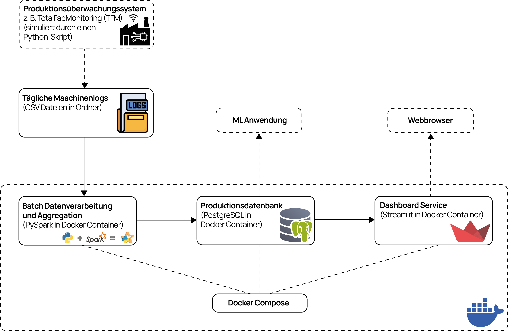

# projekt-data_engineering_iubh Batch Data Pipeline for Semiconductor Manufacturing Data - IU Portfolio Project

Dieses Repository enthält das Portfolio-Projekt für den IU Kurs "Projekt: Data Engineering" (DLMDWWDE02). 
Es implementiert eine **Batch-basierte Datenpipeline (Aufgabe 1)** zur Verarbeitung und Analyse von simulierten Maschinen-Event-Logs (z.B. Die-Bonder) aus der Halbleiterfertigung. 
Die aufbereiteten Daten werden in einer PostgreSQL Datenbank gespeichert und für eine hypothetische ML-Anwendung bereitgestellt, sowie in einem einfachen Dashboard visualisiert.

## Betrachteter Produktionsprozess

es wird ein vereinfachter Produktionszyklus simuliert, der auf die folgenden Prozessschritte reduziert wurde:
```
| Vorgang                          | Maschinen-Event        | Messparameter                                                       |
|----------------------------------|------------------------|-------------------------------------------------------------------  |
| Zyklusstart                      | Cycle_Start            | –                                                                   |
| Schritt 1: Vakuum prüfen (AS)    | AS_Check               | AS_VacuumUnits (niedriger Wert)                                     |
| Schritt 2: Chip kontaktieren     | Pick_Check             | PP_VacuumUnits (niedriger Wert), PP_Force (definierter Wertebereich)|
| Schritt 3: Chip ausstechen       | –                      | – (für diese Simulation nicht relevant)                             |
| Schritt 4: Folie lösen (AS)      | AS_Blowoff_Check       | AS_VacuumUnits (hoher Wert)                                         |
| Schritt 5: Chip platzieren       | Place_Check            | PP_Force (definierter Wertebereich)                                 |
| Schritt 6: Vakuum lösen (PP)     | Place_Check            | PP_VacuumUnits (hoher Wert)                                         |
| Zyklusende                       | Cycle_End              | –                                                                   |
```


## Architekturübersicht

Die Architektur basiert auf einem Microservice-Ansatz und wird lokal mit Docker Compose orchestriert.

*(Eine visuelle Darstellung der Architektur findet sich hier:)*


**Die Kernkomponenten sind:**

1.  **Datenquelle (Simulation):** Ein Python-Skript (`generate_data.py`) simuliert einen vorgeschalteten Datenerfassungsprozess (z.B. TotalFabMonitoring). Es erzeugt **tägliche CSV-Dateien** (`machine_event_logs_...csv`) mit Event-Daten im "langen" Format (> 1 Mio. Zeilen pro Tag), die im Verzeichnis `./raw_data` abgelegt für den Spark-Job per Bind Mount bereitgestellt werden.
2.  **Verarbeitungs-Service (`daily_aggregator_service`):** Ein Docker-Container (definiert in `Dockerfile`), der einen **PySpark**-Job (`src/daily_aggregator.py`) ausführt. Dieser Job wird typischerweise täglich (manuell oder z.B. durch einen Cron-Job/Scheduler) gestartet, um die CSV-Datei des Vortages zu verarbeiten. Er liest die Daten, führt Transformationen durch (Timestamp-Konvertierung), reichert sie an (Generierung von `cycle_seq`, `is_error` basierend auf Schwellwerten, `cycle_time_seconds`) und speichert diese aufbereiteten Events in der Datenbank. Abschließend berechnet er stündliche Aggregate.
    *   Die aufbereiteten Events werden per `append` direkt in `processed_machine_events` geschrieben.
    *   Die stündlichen Aggregate werden zunächst per `overwrite` in die Staging-Tabelle (`hourly_machine_summary_staging`) geschrieben.
    *   Im Anschluss an die Spark-Verarbeitung führt das Skript einen SQL-Merge (`INSERT ... ON CONFLICT DO UPDATE`) via psycopg2 durch, um die Daten aus der Staging-Tabelle in die finale Zieltabelle (`hourly_machine_summary`) idempotent zu übertragen.
3.  **Speicher-Service (`postgres_db`):** Ein Docker-Container mit einem **PostgreSQL**-Server. Das Schema wird automatisch beim ersten Start durch `src/init_db.sql` erstellt. Speichert die Pipeline-Ergebnisse in drei Tabellen:
    *   `processed_machine_events`: Angereicherte Einzel-Events (Schreibmodus: `append`).
    *   `hourly_machine_summary_staging`: Temporärer Speicher für stündliche Aggregate des jeweils letzten Verarbeitungslaufs (Schreibmodus: `overwrite`).
    *   `hourly_machine_summary`: Zieltabelle für die stündlichen Aggregate, historisch akkumuliert und idempotent aktualisiert (SQL-Merge `INSERT ... ON CONFLICT DO UPDATE`). Dient als Datenquelle für das Dashboard.
4.  **Visualisierungs-Service (`dashboard_service`):** Ein Docker-Container (definiert in `Dockerfile_dash`), der eine **Streamlit**-Anwendung (`src/dashboard.py`) ausführt. Diese liest die aggregierten Daten (`hourly_machine_summary`) aus der PostgreSQL-Datenbank und stellt sie interaktiv im Webbrowser dar.

## Verwendete Technologien

*   Python 3.x
*   Apache Spark 3.5 (via PySpark)
*   PostgreSQL 17
*   Streamlit
*   Pandas (im Dashboard)
*   Psycopg2 (Postgres-Treiber für Python)
*   Docker & Docker Compose
*   Git & GitHub

## Projektstruktur


```
.
├── config/
│ └── schwellwerte.json # Konfiguration der Fehlerschwellwerte
├── drivers/
│ └── postgresql-42.7.5.jar # PostgreSQL JDBC Treiber für Spark
├── images/
│ └── architecture.png # Architekturdiagramm
├── raw_data/
│ └── machine_event_logs_DieBonder_01_2024-10-16_00-00_to_2024-10-17_00-00.csv # Generierte Rohdaten (Beispiel)
├── src/
│ ├── daily_aggregator.py # PySpark Batch-Verarbeitungsskript
│ ├── dashboard.py # Streamlit Dashboard Anwendung
│ └── init_db.sql # SQL-Skript zur Initialisierung der DB-Tabellen
├── .env # Lokale Datei für DB Credentials (nicht in Git)
├── .gitignore # Ignoriert .env, pycache etc.
├── Dockerfile # Dockerfile für den PySpark-Service
├── Dockerfile_dash # Dockerfile für den Streamlit-Service
├── docker-compose.yml # Docker Compose Konfiguration
├── generate_data.py # Python-Skript zur Generierung der Rohdaten
├── README.md # Diese Datei
├── requirements.txt # Python-Abhängigkeiten für PySpark-Service
└── requirements_dash.txt # Python-Abhängigkeiten für Dashboard-Service
```

## Setup & Ausführung

**Voraussetzungen:**

*   Git
*   Docker & Docker Compose
*   Python 3.x (nur zum Ausführen des Datengenerators lokal)

**Einrichtung:**

1.  **Repository klonen:**
    ```bash
    git clone https://github.com/tim-e-0110/projekt-data_engineering_iubh.git
    cd projekt-data_engineering_iubh
    ```
2.  **JDBC Treiber:** Sicherstellen, dass die PostgreSQL JDBC Treiberdatei `postgresql-42.7.5.jar` im Ordner `drivers/` vorhanden ist (siehe `Dockerfile`).
3.  **Credentials:** Erstelle eine Datei namens `.env` im Hauptverzeichnis mit folgendem Inhalt (ersetze die Werte):
    ```dotenv
    DB_USER=mein_benutzer
    DB_PASS=mein_sicheres_passwort
    ```
4.  **Rohdaten generieren:** Führe das Skript aus, um eine Beispiel-CSV-Datei im Ordner `./raw_data/` zu erstellen:
    ```bash
    python generate_data.py <Maschine_ID> <Datum im Format YYYY-MM-DD>
    ```
5.  **Docker Images bauen:** (Kann einen Moment dauern, besonders beim ersten Mal)
    ```bash
    docker-compose build
    ```

**Ausführung:**

1.  **Datenbank und Dashboard starten:**
    ```bash
    docker-compose up -d postgres_db dashboard_service
    ```
    *Warte einen Moment, bis die Datenbank initialisiert ist (beim allerersten Start oder nach `docker volume rm ...`).*
2.  **Batch-Job ausführen:** Starte den PySpark-Job und übergib den Namen der generierten CSV-Datei als Argument:
    ```bash
    # Ersetze <dateiname.csv> der Rohdaten durch den tatsächlichen Dateinemen (nur Name, ohne Verzeichnis!)
    docker-compose run --rm daily_aggregator_service /app/daily_aggregator.py <dateiname.csv>
    ```
    *Beobachte die Log-Ausgaben im Terminal.*
3.  **Dashboard anzeigen:** Öffne deinen Webbrowser und gehe zu: `http://localhost:8501`
4.  **Aufräumen:** Stoppe und entferne die Container:
    ```bash
    docker-compose down
    ```
    *Optional: Um auch die Datenbankdaten zu löschen, verwende `docker-compose down -v`.*

## Konfiguration

*   **Schwellwerte:** Die Regeln zur Fehlererkennung für den Spark-Job (`is_error`-Flag) werden aus `config/schwellwerte.json` gelesen und können dort angepasst werden.
*   **Datenbank-Credentials:** Müssen in der `.env`-Datei definiert werden.
